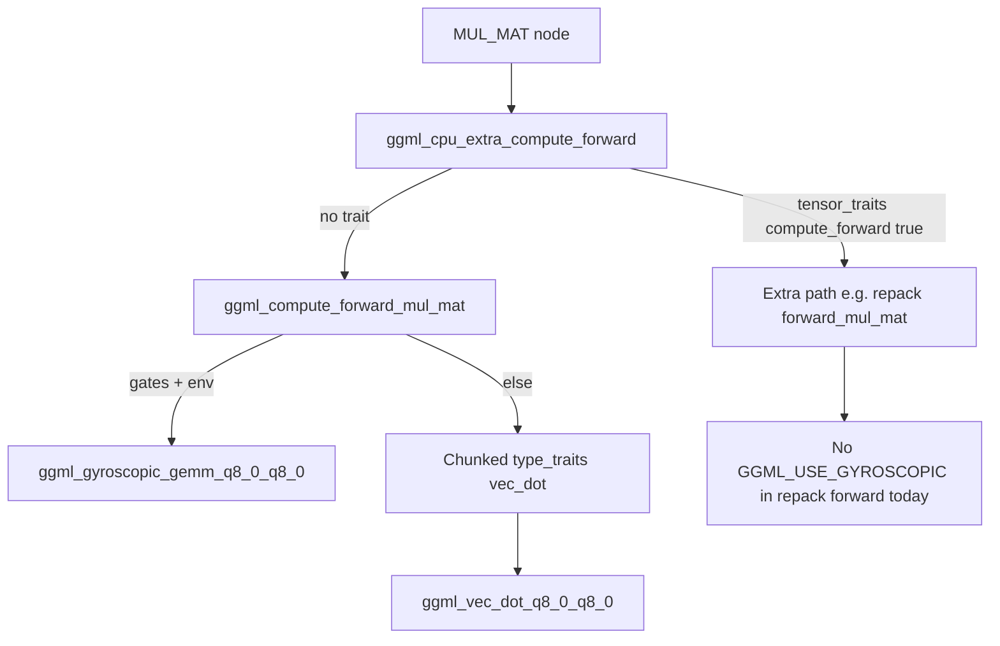

# Gyroscopic integration log

Specifics: what we wired, what we read, env/build/hooks, and structured lists. **Scope and principles: `agent.md` only** (avoid duplicating the strategy text here). **Per-file extraction workflow:** `agent_playbook.md`.

Raw per-file extractions (facts only, no procedure): `exports/<id>.md` under this workflow folder. Procedure, batches, and how to read: `agent_playbook.md` and sections below.

## Examine first (`external/llama.cpp/`)

All paths below are under `external/llama.cpp/`. Batches are completion units; finish **Batch A** before depending on op lists for **Batch B–C**. Within a batch, order is still top-to-bottom unless you already know your target op (then jump via `rg` per `agent_playbook.md`).

### Batch A -- Graph op inventory (upstream llama)

- `tests/export-graph-ops.cpp`

Output: which `GGML_OP_*` and tensor shapes appear for PP and TG for your GGUF. Does not execute kernels or show gyro hooks.

### Batch B -- Dispatch shell (`ggml-gyroscopic`)

- `ggml/src/ggml-gyroscopic/ops.cpp`
- `ggml/src/ggml-gyroscopic/ggml-cpu.c`
- `ggml/src/ggml-gyroscopic/ggml-cpu.cpp`

Op switch, `supports_op`, chunking, path from `ggml_compute_forward_*` toward matmul. Often **thin** here; heavy loops may live in Batch C.

### Batch C -- Numeric hot paths and bypasses (`ggml-gyroscopic`)

**After Batch B (and exports 1-5): read bypass wiring before tiling/quants depth.** Otherwise `codec.c` tuning can run ahead of evidence on whether repack owns the hot path.

**C1 -- Extra buffer / repack / traits (bypass question)**

- `ggml/src/ggml-gyroscopic/traits.cpp` (`ggml_cpu_extra_compute_forward`, work size)
- `ggml/src/ggml-gyroscopic/repack.cpp`
- `ggml/src/ggml-gyroscopic/arch/x86/repack.cpp`

**C2 -- vec_dot / GEMM grammar**

- `ggml/src/ggml-gyroscopic/arch/x86/quants.c`
- `ggml/src/ggml-gyroscopic/quants.c`
- `ggml/src/ggml-gyroscopic/simd-gemm.h`
- `ggml/src/ggml-gyroscopic/vec.cpp`
- `ggml/src/ggml-gyroscopic/vec.h`

Highest line volume in C2; use symbol search, not full-file reads.

### Batch D -- Harness (tools, not ggml sources)

- `tools/llama-bench/`
- `tools/perplexity/`

### Batch E -- Upstream tests (parity / quant)

- `tests/test-backend-ops.cpp`
- `tests/test-quantize-fns.cpp`
- `tests/test-quantize-perf.cpp`

## Entry points vs where the material usually is

Some paths look central but only **route** to other TUs:

- **`ops.cpp`** -- Op switchboard; many branches forward to `ggml_compute_forward_*` in `ggml-cpu.c` and friends. For matmul **shape**, read `ggml_compute_forward_mul_mat` and related; for **inner loops**, Batch C.
- **`export-graph-ops.cpp`** -- Enumerates **graph** nodes after `build_graph`; it does not show runtime dispatch order or which repack path fired. Pair with Batch B–C for execution.
- **`llama-model.cpp` / `src/models/*.cpp`** -- Build the forward **graph** (bucket A in `agent.md`); gyroscopic hooks live under `ggml-gyroscopic/` at **compute** time.
- **`vec.h`** -- Declarations; implementations and hooks are in **`vec.cpp`** (and call sites in quants / ggml-cpu).
- **`traits.cpp` / `repack.cpp` / `arch/x86/repack.cpp`** -- `ggml_cpu_extra_compute_forward` and repack traits can run **before** the generic `ggml_compute_forward` switch; this is the main **MUL_MAT bypass** surface to validate before claiming coverage.
- **`simd-gemm.h` / `repack.cpp`** -- Tiling and alternate matmul entry points; may bypass generic vec_dot when repack is active.

## Exactness classes

Use these labels in code comments, `core.h`, and bench reports so claims stay honest.

- **Kernel-exact:** Exact integer execution of the aQPU byte law and derived discrete observables on Omega (states, chirality transport, shell, signatures, etc.).
- **Deterministic-numeric:** Structurally gyroscopic tensor operators over **existing** GGUF layouts (e.g. Q8_0 blocks, fp16 per-block scales, float accumulators or reconstruction). Same inputs and rounding rules give the same outputs; this is **not** the same as kernel-exact inner algebra.
- **Structural-exact (carrier):** Exact combinatorial or bitwise structure on a defined packed view (e.g. support mask, histograms, extraction fields) even when adjacent layers use floats.

**GGUF interoperability:** gyroscopic `MUL_MAT` replacement on stock quantized
checkpoints is expected to live in **deterministic-numeric** unless and until
a native fixed-point or Gyrolabe-packed tensor format is introduced. This is
the correct and intended exactness class for llama.cpp bridge execution over
existing GGUF models.

## Three buckets (llama.cpp paths)

Rough classification under `external/llama.cpp/`. Adjust rows as the tree changes.

- **A. Run stock** -- Policy: do not touch unless hard incompatibility. Examples: `src/llama-model*.cpp`, `llama-context*.cpp`, `llama-graph*.cpp`, `llama-kv-cache*.cpp`, `llama-sampler*.cpp`, `ggml/src/ggml-alloc.c`, `ggml-backend*.cpp`, `ggml-threading.*`, `tools/llama-bench`, `tools/perplexity`, `tools/cli`.
- **B. Study and adapt** -- Policy: mine for dispatch shape, intrinsics grammar, repack, tiling; do not treat final math as sacred. Examples: `ggml-gyroscopic/quants.c`, `ggml-gyroscopic/arch/x86/quants.c`, `simd-gemm.h`, `repack.cpp`, `arch/x86/repack.cpp`, `vec.cpp`, `vec.h`, `ggml-cpu.c`, `ggml-cpu.cpp`, `ops.cpp`.
- **C. Ours + thin edits** -- Policy: Gyrolabe math and bridge; minimal routing in gyroscopic tree. Examples: `src/tools/gyroscopic/gyrolabe/core.h`, `codec.c`, `scalar.c`, `ggml-gyroscopic/gyroscopic-bridge.{h,cpp}`, targeted `#ifdef GGML_USE_GYROSCOPIC` in `vec.cpp`, `arch/x86/quants.c`, `ggml-cpu.c`, later `ops.cpp` / unary / binary if promoted.

**Ignore for current x86 CPU focus:** `ggml-gyroscopic/amx/`, `kleidiai/`, `spacemit/`, `llamafile/` (unless you explicitly enable those backends).

## Repo layout

- **`src/tools/gyroscopic/`** -- Config, loader, bench scripts.
- **`src/tools/gyroscopic/gyrolabe/`** -- `core.h`, `codec.c` (matmul kernels), `scalar.c` (support weighting, extraction), Python `ops_build.py` / `ops.py`.
- **`config/gyroscopic_llm.yaml`** -- Default GGUF, `llama-cli`, threads, `-ngl`, ctx.
- **`external/llama.cpp/ggml/src/ggml-cpu/`** -- Upstream vendor tree. **No gyro edits.**
- **`external/llama.cpp/ggml/src/ggml-gyroscopic/`** -- Our CPU backend copy: hooks, bridge, same filenames as upstream cpu backend for that variant.
- **`scripts/bench_gyromatmul_llama.py`** -- Stock vs gyro runs via `llama-cli`.
- **`scripts/build_llama_cpp_windows.ps1`** -- Example: `-DGGML_CPU_BACKEND_SUBDIR=ggml-gyroscopic -DGGML_GYROSCOPIC=ON`.

## CMake / build (facts)

- **Switch backend tree:** `GGML_CPU_BACKEND_SUBDIR=ggml-gyroscopic` (see `ggml/src/CMakeLists.txt`).
- **Gyrolabe link flag:** `GGML_GYROSCOPIC=ON` in `ggml-gyroscopic/CMakeLists.txt`.
- **Objects added when ON:** `GGML_USE_GYROSCOPIC=1`, `codec.c` + `gyroscopic-bridge.cpp`, include `gyrolabe/` + bridge dir.
- **`scalar.c`:** Present in repo for gyrolabe API; **not** automatically in the ggml target until CMake lists it (wire when ggml calls those symbols).
- **Flags:** MSVC: `/arch:AVX2`, `/fp:strict` on codec + CXX; GCC/Clang: `-mavx2 -mf16c -ffp-contract=off`.

Bench does not rebuild llama; set env and run an already-built `llama-cli`.

## File study map (`ggml-gyroscopic/`)

- **`ops.cpp`** -- Front door: op switch, tensor shapes for `MUL_MAT`, `MUL_MAT_ID`, `OUT_PROD`, `SOFT_MAX`, norms; where thin hooks belong long-term.
- **`ggml-cpu.c`, `ggml-cpu.cpp`** -- Chunking, `supports_op`, path from graph compute into matmul.
- **`quants.c`, `arch/x86/quants.c`** -- AVX2 block dots, horizontal reductions, `madd`/`widening` patterns, scale handling, block loop order. Grammar reference for our kernels, not inherited semantics.
- **`simd-gemm.h`** -- GEMM tiling, microkernel layout, cache-friendly blocking (use to replace naive `i,j,k` in `codec.c`).
- **`repack.cpp`, `arch/x86/repack.cpp`** -- Repack contracts, GEMM/GEMV entry points that can bypass generic `vec_dot`; layout for feeding fast kernels.
- **`vec.cpp`, `vec.h`** -- Utility dot/max/sum patterns; hook site for `ggml_vec_dot_f32`.
- **`binary-ops.cpp`, `unary-ops.cpp`** -- Secondary: elementwise style; **GELU/SILU** live in **`ops.cpp`** + **`vec.h`**, not unary-ops (`exports/17.md`, **`exports/18.md`**). **`common.h`**, **`ggml-cpu-impl.h`**: `exports/20.md`.
- **`traits.cpp`** -- Extra-buffer `compute_forward` dispatch and work sizing; **required** for honest MUL_MAT coverage claims (not optional).

**Quants row (precise):** do not reduce this to "replace `_mm256_fmadd_ps`". Study the full dot-kernel structure (loads, widening, horizontal sum, scale fusion, register blocking) and reimplement the **gyroscopic** inner contraction inside that shape.

## Reading order (practical)

1. **Batch A:** run or read `tests/export-graph-ops.cpp` for your GGUF (pp + tg op list).
2. **Batch B:** dispatch and chunk boundaries (`ops.cpp`, `ggml-cpu.c`, `ggml-cpu.cpp`).
3. **Batch C1:** `traits.cpp`, `repack.cpp`, `arch/x86/repack.cpp` -- answer whether extra-buffer / repack can bypass generic `MUL_MAT` and your hooks.
4. **Batch C2:** `arch/x86/quants.c`, `quants.c`, `simd-gemm.h`, `vec.cpp`, `vec.h` -- kernel grammar once bypass map is understood.
5. **Batch D–E:** `llama-bench`, `perplexity`, selected `tests/test-backend-ops.cpp` and quant tests as needed.

If a file in B looks empty of the math you need, use **Entry points vs where the material usually is** above and follow the callee into Batch C.

**Exports alignment:** **`exports/1.md` through `exports/20.md`** complete the catalog in `exports/agent_exports.md` (IDs are not 1..20 contiguous: **8, 9, 19** are C1; **12–16** are tools/tests; **17–18, 20** are secondary ops/headers). **Synthesis** (bypass map + **`codec.c`** priorities + validation order) lives in section **Synthesis** below **Findings**.

## Grain note (32 vs 64)

Q8_0 blocks are 32-wide; many Gyrolabe / horizon constructions are 64-native. **Two Q8_0 blocks = one 64-wide execution packet** is the natural fusion axis when designing gyroscopic matmul (zero-copy or low-copy preferred). Keep this in mind when reading repack and quants loops.

## Hook sites (current)

All under `ggml-gyroscopic/`, guarded by `GGML_USE_GYROSCOPIC`.

- **`vec.cpp`** -- Start of `ggml_vec_dot_f32`: bridge when active; strict -> abort if bridge fails.
- **`arch/x86/quants.c`** -- Start of `ggml_vec_dot_q8_0_q8_0`: same pattern; layout assert vs gyrolabe block type.
- **`ggml-cpu.c`** -- `ggml_compute_forward_mul_mat`: after quant workspace setup, gyroscopic Q8_0 GEMM path when shapes match; else falls through to chunked `vec_dot`.

Repack `forward_mul_mat*` and `OUT_PROD` may still use stock paths unless separately wired; strict mode behavior is defined in bridge + those call sites (see git history or grep `ggml_gyroscopic_`).

## Coverage risk

Hooking `vec_dot` and direct GEMM entry points is not sufficient to claim full
ownership of `MUL_MAT`. Repack-driven `forward_mul_mat` paths, dtype-specific
fast paths, and any fused graph execution branches can bypass generic dot
routing. Coverage claims for gyroscopic matmul are valid only after the active
graph op surface has been extracted for the target model and all relevant
matmul-bearing paths are either hooked, redirected, or fail loudly in strict
mode.

## Findings (current target: Qwen3.5-4B-Q8_0)

Evidence: `exports/qwen3_ops_coverage.md` and `exports/qwen3_ops.txt` (PP+TG merged unique patterns), plus workflow exports **`exports/1.md`–`exports/20.md`** (see `exports/agent_exports.md` for ID map), including C1 **`exports/8.md`**, **`exports/9.md`**, **`exports/19.md`**.

- `export-graph-ops` on the default target GGUF shows **`GGML_OP_MUL_MAT` present**; **`GGML_OP_MUL_MAT_ID`** and **`GGML_OP_OUT_PROD`** do **not** appear among distinct op integers in that export for this model/build. Immediate substitution focus for this graph is **`MUL_MAT`**; `MUL_MAT_ID` / `OUT_PROD` stay roadmap unless a different GGUF or build changes the op surface.
- In `ggml-cpu.c`, `ggml_compute_forward_mul_mat` has two gyro-relevant routes: (1) early **`ggml_gyroscopic_gemm_q8_0_q8_0`** when env and shape/type checks pass (bypasses per-dot vec_dot); (2) fallback **chunked** path using `type_traits_cpu[*].vec_dot`, which for Q8_0×Q8_0 reaches **`ggml_vec_dot_q8_0_q8_0`** (hook in `arch/x86/quants.c`).
- Stock **`ggml_vec_dot_q8_0_q8_0`** (x86 AVX2): **32-wide** `QK8_0` blocks, `maddubs`-family integer contraction, then **fp16 block scales to float** and **float FMA** accumulation (**deterministic-numeric** class for the bridge, not kernel-exact inner law).
- **Coverage risk:** `ggml_cpu_extra_compute_forward` may handle the tensor **before** the generic dispatch; extra-buffer traits (notably **repack** when enabled) can bypass generic `MUL_MAT` + vec_dot/GEMM hooks. Batch C1 is now summarized in **`exports/19.md`** (extra loop), **`exports/8.md`** (repack), **`exports/9.md`** (x86 repack microkernels).
- **Repack vs this target (Q8_0, x86 AVX2):** `ggml_repack_get_optimal_repack_type` returns a **Q8_0** trait only on **Neon** (int8 mm / dotprod) or **RISC-V** (`__riscv_zvfh`); there is **no AVX2 branch** for `GGML_TYPE_Q8_0`. So typical **Windows x86** builds likely keep **Q8_0 weights on host buffer** and use **generic** `ggml_compute_forward_mul_mat` (gyro GEMM / `ggml_vec_dot_q8_0_q8_0`), not repack `forward_mul_mat`. Repack `gemm`/`gemv` for Q8_0×Q8_0 uses **generic** `ggml_gemm_q8_0_*` bodies in **`repack.cpp`** on x86 (no specialized `ggml_gemm_q8_0_*` in **`arch/x86/repack.cpp`**); Q4-style paths in x86 repack still matter for other quantizations.
- **F32 `simd_gemm` (`simd-gemm.h`, `exports/7.md`):** Used from **`ops.cpp`** flash-attention-style tiles on **dequantized float** buffers; it does **not** replace Q8_0 weight `MUL_MAT` and does **not** use `ggml_vec_dot_f32`. Separate coverage surface if attention GEMM must be gyro-owned.
- **`MUL_MAT_ID`:** no dedicated gyroscopic GEMM early-exit in the analyzed `ggml-cpu.c` region (`exports/3.md`); lower priority for this target graph in any case.
- Quantized **`OUT_PROD`** (when it appears elsewhere): **`to_float` dequant + `vec_mad_f32`** in `ops.cpp` (`exports/2.md`) -- different surface from Q8_0 vec-dot matmul hooks.
- **Elementwise binary** (`binary-ops.cpp`, `exports/17.md`): **ADD/SUB/MUL/DIV** only, all via float ops; **no** tensor **AND/OR/XOR**. **GELU/SILU** dispatch is **`ops.cpp` + `vec.h`**, not **`unary-ops.cpp`** (`exports/18.md`).

## Synthesis: MUL_MAT bypass map and `codec.c` priorities

This section folds **`exports/qwen3_ops_coverage.md`**, the **`exports/1.md`–`20.md`** catalog, and **`agent.md`** scope into one actionable map. Revisit when the GGUF or CPU arch changes.

### 1. Op surface check (Qwen3.5-4B-Q8_0, export-graph merge)

From **`exports/qwen3_ops_coverage.md`**, matmul-class ops that actually appear as distinct enum values in the export:

- **`GGML_OP_MUL_MAT` (29)** -- present (multiple shape patterns).
- **`GGML_OP_MUL_MAT_ID`**, **`GGML_OP_OUT_PROD`** -- **not** in this export set.

Other nodes that can carry **dense linear algebra** without using the **`MUL_MAT`** enum on the same line of reasoning:

- **`GGML_OP_FLASH_ATTN_EXT` (73)** -- internal **F32 `simd_gemm`** tiles (`exports/7.md`); not Q8_0 weight matmul.
- **`GGML_OP_SSM_CONV` (75)**, **`GGML_OP_GATED_DELTA_NET` (85)** -- on graph; kernel routing not expanded in the export series (treat as **follow-up** if parity is required there).

**Conclusion for default target:** close **Q8_0 `MUL_MAT`** first; treat **flash-attn F32 GEMM** as a **separate** hook surface if attention must be gyro-owned.

### 2. Ordered bypass map (every `MUL_MAT` node)

At compute time, **generic** `ggml_compute_forward` still runs **`ggml_cpu_extra_compute_forward` first** (`exports/19.md`). Only if **no** extra trait handles the node does execution reach the usual **`ggml_compute_forward_mul_mat`** body (`exports/3.md`).

**Hooked today (gyroscopic build):** **`G`** (bridge GEMM), **`Q`** (bridge vec_dot). **F32 `MUL_MAT`** uses **`ggml_vec_dot_f32`** (`exports/10.md`), not **`Q`**.

### 3. Path table (x86 AVX2, Q8_0 weights, typical Windows)

| Path | When it runs | Gyro hooks today | Risk if unhooked |
|------|----------------|------------------|------------------|
| **Extra / repack `MUL_MAT`** | Repack buffer + non-null optimal trait + `supports_op` | **None** in repack GEMM/GEMV (`exports/8.md`) | Silent bypass of **`G`** and **`Q`** |
| **Q8_0 on x86 + repack** | `ggml_repack_get_optimal_repack_type` for **`GGML_TYPE_Q8_0`** | **Neon / RISC-V only**; **no AVX2 branch** (`exports/8.md`) | For this target OS/ISA, repack Q8_0 path **likely off**; generic **`M`** dominates |
| **Gyro GEMM `G`** | Env + shape/type gates in **`ggml-cpu.c`** | **Yes** | Primary **wide** win when eligible |
| **Stock vec_dot `Q`** | Fallback chunked matmul | **Yes** (x86 implementation) | Default path when **`G`** does not take |

### 4. `codec.c` rewrite and tuning priorities

Aligned with **deterministic-numeric** exactness for GGUF Q8_0 (`exports/5.md`, `exports/6.md`):

1. **Block inner kernel (32-wide, two-block 64 fusion optional)** -- Match **`arch/x86/quants.c`** `ggml_vec_dot_q8_0_q8_0` grammar (loads, int8 dot, horizontal reduce, fp16 scale, float acc) so **`Q`** path is faithful and fast; keep bridge **`strict`** meaningful.
2. **GEMM / strip-mining** -- Align tile boundaries with **`ggml-cpu.c`** chunking and **`ggml_gyroscopic_gemm_q8_0_q8_0`** contract so **`G`** fires when intended and avoids partial-block edge bugs.
3. **Numerical guardrails** -- Same rounding story as stock (fp16 `d`, float acc); document any intentional deviation in bench reports.
4. **Defer:** **`simd_gemm.h`-style F32** microkernels for **flash-attn** until **`MUL_MAT`** coverage is closed or attention is explicitly in scope.
5. **Defer:** **`MUL_MAT_ID`**, **`OUT_PROD`** kernels until export-graph shows them for a target GGUF.

### 5. Validation order (after code changes)

1. **`test-quantize-fns`** / subset **`test-backend-ops`** with gyroscopic CPU backend when CI allows (`exports/15.md`, **`exports/14.md`**).
2. **`GGML_GYROSCOPIC_TRACE=1`** on **`llama-bench`** or **`llama-cli`** -- nonzero **`gemm_q8_0`** and/or **`vec_dot_q8_0_q8_0`** (`exports/12.md`, **`scripts/bench_gyromatmul_llama.py`**).
3. Re-run **`export-graph-ops`** only if the **graph** shape changes; it does not prove which kernel ran.

## Runtime env (`gyroscopic-bridge.cpp`)

- **`GGML_GYROSCOPIC_MATMUL`** -- Default `0`. Role: master switch for gyroscopic matmul hooks.
- **`GGML_GYROSCOPIC_STRICT`** -- Default `1`. Role: abort on unsupported hooked path when matmul on.
- **`GGML_GYROSCOPIC_TRACE`** -- Default `0`. Role: startup banner + exit counters on stderr.
- **`GGML_GYROSCOPIC_KERNEL`** -- Default `avx2`. Role: `ref` or `avx2` for `codec.c` dispatch.

Trace lines (when trace on): startup `GyroMatMul: compiled=1 ...`; exit `GyroMatMul trace: vec_dot_f32=... vec_dot_q8_0_q8_0=... gemm_q8_0=...`.

## Native upstream tools (see `exports/12.md`, `exports/13.md`)

- **`llama-bench`** (`tools/llama-bench/`) -- CSV-friendly **tok/s** grids; CPU-only example: `-m <gguf> -t 1 -ngl 0`. Toggle **`GGML_GYROSCOPIC_*`** in the shell; compare **`avg_ts`** / **`stddev_ts`**.
- **`llama-perplexity`** (`tools/perplexity/`) -- **PPL** + **`llama_perf_context_print`**; example: `-m <gguf> -t 1 -ngl 0 -c 512 -f <corpus.txt>`. Same env vars as any llama binary linked to gyroscopic ggml.

## Bench harness env (`scripts/bench_gyromatmul_llama.py`)

- **`GYRO_BENCH_INCLUDE_REF`** -- Add slow `gyro_ref` run for parity.
- **`GYRO_BENCH_SMOKE`** -- Short first prompt.
- **`GYRO_BENCH_MAX_PROMPTS`** -- Cap prompt count.
- **`GYRO_BENCH_N_PREDICT`** -- Tokens per run.
- **`GYRO_BENCH_TIMEOUT_SEC`** -- Subprocess wall limit.
- **`GYRO_BENCH_POLL_SEC`** -- Wait poll interval.
- **`GYRO_BENCH_VERBOSE`** -- Progress lines.

## Python config overrides (`config.py`)

- **`GYROSCOPIC_GGUF_PATH`** -- Overrides `gguf_path`.
- **`GYROSCOPIC_LLAMA_CLI`** -- Overrides `llama_cli_path`.
- **`GYROSCOPIC_N_CTX`** -- Overrides `n_ctx`.
- **`GYROSCOPIC_N_THREADS`** -- Overrides `n_threads`.
- **`GYROSCOPIC_N_GPU_LAYERS`** -- Overrides `n_gpu_layers`.
- **`GYROSCOPIC_VERBOSE`** -- Overrides `verbose`.

## Gyrolabe C API (`core.h` / `codec.c` / `scalar.c`)

- **`gyromatmul_*`** -- vec_dot, GEMM, out_prod; kernel mode via env (cached).
- **`gyrolabe_attention_uniform_weights_f32`** -- Support-based weights (softmax replacement surface).
- **`gyrolabe_extract_fields_fused`** -- QuBEC chart extraction.

`ops_build.py` builds `gyrolabe_native.dll` for **Python** tests; **`llama-cli`** uses `codec.c` linked through ggml when `GGML_GYROSCOPIC=ON`.

## Bridge API (`gyroscopic-bridge.h`)

- **`ggml_gyroscopic_active` / `strict` / `trace`** -- Env.
- **`ggml_gyroscopic_vec_dot_f32`** -- F32 dot path.
- **`ggml_gyroscopic_vec_dot_q8_0_q8_0`** -- n elements -> n/32 blocks.
- **`ggml_gyroscopic_gemm_q8_0_q8_0`** -- Q8 GEMM entry.
- **`ggml_gyroscopic_abort_unsupported`** -- Strict failure.

## Target model (default config)

- `data/models/unsloth-Qwen3.5-4B-GGUF/Qwen3.5-4B-Q8_0.gguf` unless overridden in YAML.

## Current target surface

CPU x86 inference for the default target GGUF: own **`MUL_MAT`** on every path the graph and build actually exercise (including repack / extra-buffer bypasses), with trace and strict mode honest about gaps. For **Qwen3.5-4B-Q8_0** as in `exports/qwen3_ops_coverage.md`, the exported op surface centers on **`MUL_MAT`**; **`MUL_MAT_ID`** and **`OUT_PROD`** are not in that pattern set and are not the immediate blocker for that model. `MUL_MAT_ID` / `OUT_PROD` remain in scope for other models and for full backend completeness. Other op substitutions (norms, rope, flash-attn, unary, etc.) stay secondary per `agent.md` until matmul coverage is closed. **Consolidated bypass map and `codec.c` ordering:** section **Synthesis** above.

## Troubleshooting

- No gyro banner / trace: binary not built with `ggml-gyroscopic` + `GGML_GYROSCOPIC=ON`.
- Hashes match but bench marks fatal: possible env-only match without gyro path firing; check trace counters and `gemm_q8_0`.

## Changelog (high level)

- `gyroscopic-bridge` centralizes ggml-facing glue; hooks in `vec.cpp`, `arch/x86/quants.c`, `ggml-cpu.c` for matmul-related paths.
- `GGML_CPU_BACKEND_SUBDIR=ggml-gyroscopic` selects this tree; vendor `ggml-cpu/` stays clean.
- This log holds specifics; `agent.md` holds scope only (split to reduce duplication).
- **2026-04:** Per-file extraction set **`workflow/exports/1.md`–`20.md`** finished per `exports/agent_exports.md` (binary/unary/common headers: **`exports/17.md`**, **`exports/18.md`**, **`exports/20.md`**).
- **2026-04:** Added **Synthesis** section (MUL_MAT bypass map, mermaid flow, path table, **`codec.c`** priorities, validation order) tied to **`exports/qwen3_ops_coverage.md`**.
